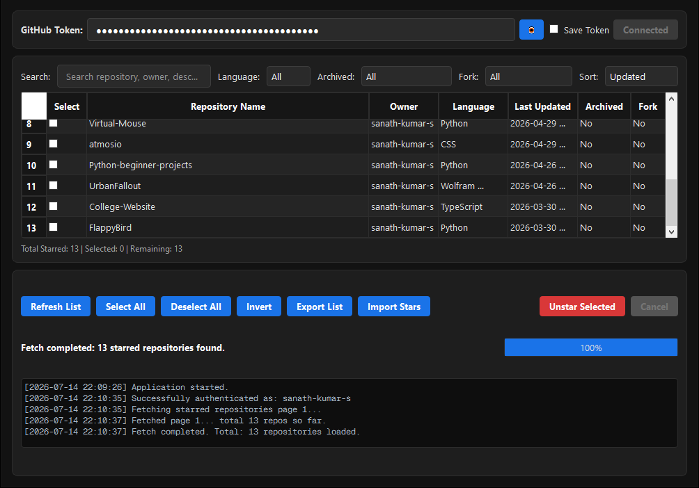

<h1 align="center"> Unstarify </h1>
<p align="center">
  
</p>

<div align="center">

[](https://www.python.org/)
[](https://wiki.qt.io/Qt_for_Python)
[](https://docs.github.com/en/rest)
[](LICENSE)
[](https://github.com)

A modern, feature-rich desktop application for efficiently managing your GitHub stars. Built with PySide6 (Qt6) and optimized for handling thousands of starred repositories with a sleek dark-themed UI.

[Features](#-features) • [Installation](#-installation--setup) • [Usage](#-usage) • [API Details](#-api-usage--data-details) • [Contributing](#-contributing)

</div>

---

## ✨ Features

### 🎨 Modern User Interface
- **Dark Theme Design**: Custom QSS stylesheet with a sleek, professional dark aesthetic
- **Responsive & Intuitive**: Clean layout with organized tabs and sections
- **High Performance**: Handles 5000+ starred repositories without lag or stuttering

### ⚡ Advanced Functionality
- **Asynchronous Design**: Background workers via `QThread` with `Signals` and `Slots` keep the UI responsive
- **Live Search & Filter**: Instantaneous full-text search by name, owner, description, or topics
- **Smart Filtering**: Filter by Language, Archived status, and Fork status simultaneously
- **Multiple Sort Options**: Sort by Repository Name, Owner, Language, or Last Updated date
- **Batch Operations**: Select multiple repositories and perform actions en masse

### 🔐 Security & Authentication
- **Secure Token Connection**: Connect with GitHub Personal Access Token (PAT)
- **Optional Local Storage**: Safely store credentials locally (encrypted option available)
- **No Browser Automation**: Uses official GitHub REST API exclusively—no Selenium or web scraping

### 📊 Interactive Repository Grid
- **Native Checkboxes**: `☑` / `☐` for intuitive multi-select operations
- **Quick Actions**: 
  - Select All / Deselect All / Invert Selection
  - Right-click context menu (Open Repository, Copy URL, Open Owner Profile)
  - Double-click to open repository directly in browser
- **Real-time Updates**: Immediate feedback on all operations

### 📈 Progress & Monitoring
- **Interactive Progress Bar**: Live estimated completion times and real-time counters
- **Cancellation Controls**: Stop operations at any time
- **Console Log Output**: Timestamped operation logs in a clean, scrollable code-font window
- **Error Handling**: Detailed logging of failures and retry attempts

### 💾 Data Import/Export
- **Export Formats**: Save your starred repositories to CSV or JSON
- **Import Backups**: Load JSON backups to compare with current account status
- **Smart Re-starring**: Automatically re-star missing repositories from backups
- **Data Integrity**: Verify and sync your local backups with live GitHub data

### 🧹 Maintenance Tools
- **One-Click Cleanup**: Clear settings, credentials, and cache folders
- **Configuration Reset**: Easily reset all app preferences and tokens
- **Data Wipe**: Securely remove sensitive information

---

## 🚀 Installation & Setup

### Prerequisites
- **Python**: Version 3.11 or higher
- **GitHub Account**: With a Personal Access Token (PAT)
- **PAT Scopes**: 
  - `public_repo` – for managing public repository stars
  - `repo` – for managing both public and private repository stars

### Step 1: Clone the Repository
```bash
git clone https://github.com/yourusername/github-stars-manager.git
cd github-stars-manager
```

### Step 2: Install Dependencies
Install all required packages in one command:
```bash
pip install -r requirements.txt
```

Or manually install:
```bash
pip install PySide6 requests python-dotenv
```

### Step 3: Generate Your GitHub PAT
1. Go to [GitHub Settings → Developer Settings → Personal Access Tokens](https://github.com/settings/tokens)
2. Click "Generate new token (classic)"
3. Select scopes: `public_repo` (or `repo` for private repos)
4. Copy the token and keep it safe

### Step 4: Run the Application
```bash
python main.py
```

### Step 5 (Optional): Reset Configuration
To wipe all saved tokens, config, and cache:
```bash
python clear_data.py
```

---

## 📖 Usage Guide

### Connecting Your GitHub Account
1. Launch the application
2. Paste your GitHub Personal Access Token
3. Click "Connect" to authenticate
4. Your starred repositories load automatically

### Searching & Filtering
- **Search Bar**: Type to filter by repository name, owner, or description in real-time
- **Language Filter**: Select a programming language to show only those repositories
- **Status Filters**: Toggle "Archived" and "Forks" visibility
- **Sorting**: Click column headers to sort by different criteria

### Bulk Operations
1. **Select repositories** using checkboxes
2. **Use batch actions**:
   - Remove stars from selected repos
   - Export selected repos to CSV/JSON
   - Open all in browser (opens owner profile)
3. **Monitor progress** with the live progress bar

### Context Menu Actions
Right-click any repository to:
- 🌐 **Open Repository** – Opens in default browser
- 📋 **Copy URL** – Copies repo URL to clipboard
- 👤 **Open Owner Profile** – Opens owner's GitHub profile

### Exporting Your Data
1. Select repositories (or select all)
2. Click "Export"
3. Choose format: **CSV** or **JSON**
4. File saves to your specified location

### Importing & Syncing
1. Click "Import"
2. Select a previously exported JSON file
3. App compares with current starred repos
4. Review differences and confirm
5. Auto-star missing repositories

---

## 🔌 API Usage & Data Details

### API Integration
The application uses the **official GitHub REST API** exclusively. No browser automation, Selenium, or scraping is involved.

### Endpoints Used

#### 1️⃣ Token Validation
```
GET https://api.github.com/user
Authorization: Bearer <TOKEN>
```
- **Purpose**: Authenticates the token and retrieves the logged-in username
- **Response**: User profile information

#### 2️⃣ Fetch Starred Repositories
```
GET https://api.github.com/user/starred?per_page=100&page=<n>
Accept: application/vnd.github.star+json
Authorization: Bearer <TOKEN>
```
- **Purpose**: Retrieves paginated list of all starred repositories
- **Parameters**: 
  - `per_page`: 100 (maximum per-page limit for efficiency)
  - `page`: Incremented to fetch all pages
- **Special Header**: Custom `Accept` header pulls `starred_at` timestamps

#### 3️⃣ Remove Star
```
DELETE https://api.github.com/user/starred/{owner}/{repo}
Authorization: Bearer <TOKEN>
```
- **Purpose**: Unstar a specific repository
- **Response**: 204 No Content on success

#### 4️⃣ Add Star
```
PUT https://api.github.com/user/starred/{owner}/{repo}
Authorization: Bearer <TOKEN>
```
- **Purpose**: Star a repository (used for re-starring imported repos)
- **Response**: 204 No Content on success

### Rate Limit & Error Handling

#### Primary Rate Limits
- **Monitoring**: Tracks `X-RateLimit-Remaining` and `X-RateLimit-Reset` headers
- **Auto-Pause**: When remaining quota reaches 0, automatically pauses operations
- **Smart Resume**: Calculates exact sleep duration and resumes automatically

#### Secondary / Abuse Limits
- **403 Handling**: Detects HTTP 403 rate limits
- **Retry Strategy**: Extracts `Retry-After` header and waits specified duration
- **Prevention**: Implements exponential backoff to avoid repeated throttling

#### Retry Mechanism
- **Transient Failures**: Automatically retries up to 3 times for network issues
- **Detailed Logging**: All retry attempts logged to console with timestamps
- **Graceful Skipping**: Failures after max retries are logged and skipped

### Data Schema

Each starred repository stores the following fields:

| Field | Type | Description |
|-------|------|-------------|
| `id` | Integer | Unique Repository ID |
| `name` | String | Repository name |
| `owner` | String | Owner's GitHub login |
| `description` | String | Repository description (nullable) |
| `language` | String | Main programming language |
| `topics` | Array | Keywords/tags associated with repo |
| `fork` | Boolean | Whether repo is a fork |
| `archived` | Boolean | Whether project is archived |
| `private` | Boolean | Public/Private visibility |
| `created_at` | Timestamp | Repository creation date |
| `updated_at` | Timestamp | Last update timestamp |
| `html_url` | String | Repository web URL |
| `default_branch` | String | Primary branch name (e.g., `main`) |
| `avatar_url` | String | Owner's profile picture URL |
| `starred_at` | Timestamp | When you starred it |

---

## 🏗️ Project Structure

```
github-stars-manager/
├── main.py              # Entry point for the Qt application
├── gui.py               # PySide6 UI, stylesheets, and worker management
├── api.py               # GitHub REST API integration & rate limiting
├── models.py            # Repository dataclass definition
├── utils.py             # File I/O (CSV/JSON) & comparison utilities
├── config.py            # Configuration & preference management
├── clear_data.py        # Data cleanup & reset utility
├── requirements.txt     # Python dependencies
└── README.md            # This file
```

### Module Details

- **`main.py`**: Application entry point; initializes the Qt event loop and main window
- **`gui.py`**: Manages all UI components, QSS styling, context menus, and launches background workers to prevent blocking
- **`api.py`**: Handles GitHub API requests, pagination, rate throttling, and error recovery
- **`models.py`**: Defines the `Repository` dataclass for type-safe data handling
- **`utils.py`**: Provides utility functions for JSON/CSV export, import, and data comparison
- **`config.py`**: Manages local configuration (`config.json`), window state, and preferences
- **`clear_data.py`**: One-click tool to reset all configurations and wipe stored secrets

---

## 🛠️ Development

### Building from Source
```bash
# Clone repo
git clone https://github.com/yourusername/github-stars-manager.git
cd github-stars-manager

# Create virtual environment (optional but recommended)
python -m venv venv
source venv/bin/activate  # On Windows: venv\Scripts\activate

# Install dependencies
pip install -r requirements.txt

# Run application
python main.py
```

### Code Style
- Follow PEP 8 guidelines
- Use type hints where applicable
- Keep functions focused and modular
- Document complex logic with docstrings

---

## 📝 License

This project is licensed under the **MIT License** – see the [LICENSE](LICENSE) file for details.

---

## 🤝 Contributing

Contributions are welcome! To get started:

1. **Fork** the repository
2. **Create a feature branch** (`git checkout -b feature/amazing-feature`)
3. **Commit changes** (`git commit -m 'Add amazing feature'`)
4. **Push to branch** (`git push origin feature/amazing-feature`)
5. **Open a Pull Request**

### Areas for Contribution
- 🐛 **Bug fixes** – Report and fix issues
- ✨ **Features** – Suggest new functionality
- 📚 **Documentation** – Improve guides and comments
- 🎨 **UI/UX** – Enhance design and usability
- ⚡ **Performance** – Optimize code and speed

---

## ❓ FAQ

**Q: Is my GitHub token stored securely?**
A: By default, tokens are stored in text in `config.json` locally in your system. So there are no external threats.

**Q: Can I use this with GitHub Enterprise?**
A: Currently, the app is designed for GitHub.com. Enterprise support can be added with minor modifications.

**Q: What if I reach the API rate limit?**
A: The app automatically detects rate limits and pauses operations. It resumes automatically once the limit resets.

**Q: How long does it take to export 5000+ stars?**
A: Initial fetch takes ~2-3 minutes depending on your connection. Exports are instantaneous.

**Q: Can I remove all my stars at once?**
A: Yes! Use "Select All" and then "Remove Stars" to batch unstar repositories. Progress will be shown in real-time.

---

## 📞 Support & Feedback

- 🐛 **Report Issues**: [GitHub Issues](https://github.com/yourusername/github-stars-manager/issues)
- 💡 **Feature Requests**: Open an issue with the `enhancement` label
- 📧 **Contact**: [Your email or contact info]

---

## 🙏 Acknowledgments

- Built with [PySide6](https://wiki.qt.io/Qt_for_Python) – Python bindings for Qt6
- Powered by [GitHub REST API](https://docs.github.com/en/rest)
- Inspired by the need for better GitHub stars management

---

<div align="center">

**[⬆ back to top](#-github-stars-manager--remover)**

Made with ❤️ by [Your Name/Team]

</div>
